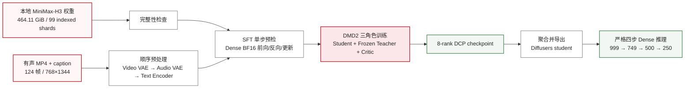
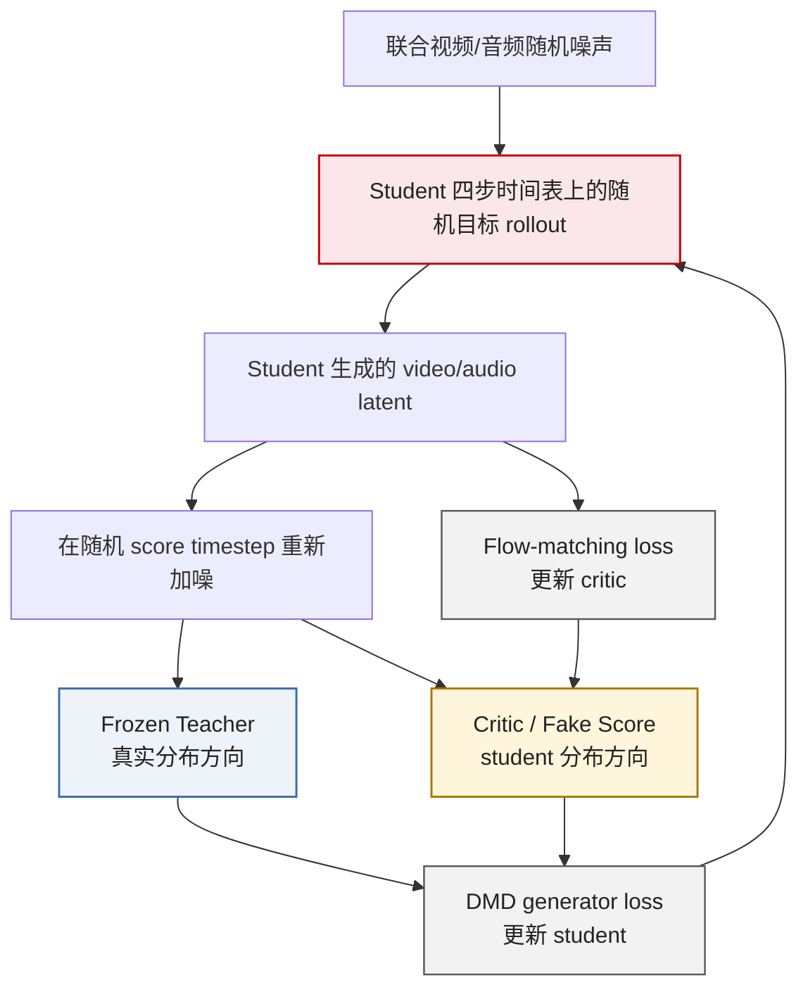

# MiniMax-H3 Dense DMD2 四步蒸馏昇腾 910B 技术最佳实践

> 本文记录在 8 张 Ascend 910B 上，将 FastVideo 的 MiniMax-H3 文生视频带音频（T2VA）训练链路扩展为 Dense DMD2 四步蒸馏，并完成“数据预处理—真实训练—分布式 checkpoint—独立模型导出—严格四步推理”的工程闭环。本文只讨论 Dense Attention，不包含 VSA。

## 1. 摘要

MiniMax-H3 原始推理使用 50 个噪声调度点，对应 49 次 Transformer 前向。长视频的单次前向计算量较大，多步迭代会进一步放大推理时延；与此同时，DMD2 训练需要同时维护 student、冻结的 teacher 和可训练的 critic，直接迁移到 8×64 GB Ascend 910B 时，还会遇到显存、HCCL 通信、设备接口和分布式 checkpoint 格式等工程问题。

本实践以固定版本 FastVideo 为底座，实现 MiniMax-H3 专用 Dense DMD2 方法：student 按 `[999, 749, 500, 250]` 完成四步 rollout，teacher 提供真实分布方向，critic 学习 student 当前生成分布；视频 latent 和双声道音频 latent 使用各自的噪声 shift 联合训练。运行层采用 HCCL、8 路 sequence parallel、FSDP 全分片、CPU offload、BF16 和完整激活重计算，并补齐权重校验、数据预处理、导出、四步推理与同条件对比工具。

在工程验证中，464.11 GiB MiniMax-H3 权重通过完整性检查，99 个索引分片全部可解析；单条 124 帧、768×1344、有音轨样本通过 T2VA 预处理；8 卡 SFT 单步和 DMD2 单步均完成真实前向、反向、优化器更新和 checkpoint 保存；导出的 student 可按严格四步完成视频生成。相对于原模型 49 次 Transformer 前向，四步 student 的 Transformer 前向次数减少 91.84%，前向次数比为 12.25:1。该比例是结构性计算步数对比，不等同于已测得的端到端加速比；单步训练结果用于证明链路可运行，不代表模型已经收敛。

### 结果速览

| 项目 | 原始 MiniMax-H3 | 本实践四步 student | 结论 |
| --- | ---: | ---: | --- |
| 噪声调度点 | 50 | 5 | 相邻调度点之间各执行一次更新 |
| Transformer 前向次数 | 49 | 4 | 减少 45 次，降幅 91.84% |
| 前向次数比 | 12.25 | 1 | 仅表示 DiT 调用次数，不是端到端实测速比 |
| 注意力实现 | Dense | Dense SDPA | 未引入 VSA 稀疏化变量 |
| 视频与音频 | 联合生成 | 联合蒸馏、联合生成 | 保留 H3 T2VA 输出结构 |
| 训练闭环 | 基模 | 1 个 DMD2 optimizer step | 已验证反向、更新与保存 |
| 严格四步推理 | 不适用 | 已输出可播放视频 | 证明产物可加载、可执行 |
| 收敛质量 | 基模能力 | 本次未做长周期收敛评测 | 不据单步样例外推质量 |

## 2. 业务背景与面临挑战

### 2.1 为什么需要步数蒸馏

扩散或流匹配视频模型从随机噪声开始，经过多个时间步逐渐得到视频 latent。每个时间步通常需要执行一次大规模 Transformer。图像模型的单次前向已经不低，视频又多出时间维，并且 H3 同时生成音频；因此，采样步数会直接放大 Transformer 主干的总计算量。

步数蒸馏的目标不是简单删掉 45 次计算，而是让 student 在每一次更大的状态跳跃中，仍能朝 teacher 的生成分布移动。若只把原模型的 49 步调度器强行改成 4 步，模型没有学会跨越更大的噪声区间，通常会造成结构、运动、细节或声音质量下降。训练的核心问题因此变成：**如何用 4 次 student 前向近似原始多步模型形成的生成分布。**

### 2.2 需求和约束

| 维度 | 目标或约束 | 对方案的影响 |
| --- | --- | --- |
| 硬件 | 单机 8×Ascend 910B，每卡 64 GB | 需要 HCCL、FSDP 和序列并行 |
| 模型 | MiniMax-H3，Transformer 约 33B | DMD2 三角色无法按普通单卡方式常驻 |
| 模态 | 视频 + 双声道音频联合生成 | 训练方法必须处理有序双 latent，不能复用单 tensor 假设 |
| 蒸馏目标 | Dense 四步 student | 不依赖 VSA、FA4 或 CUDA 专用稀疏算子 |
| 精度 | BF16 训练；优先保证数学路径一致 | 暂不以训练吞吐为第一目标 |
| 数据环境 | 训练机不能访问 Hugging Face | 权重、样本和依赖必须支持离线准备 |
| 第一阶段目标 | 跑通一个真实 DMD2 optimizer step，并能严格四步推理 | 先验证工程闭环，再扩大数据和训练步数 |

### 2.3 挑战量化

| 挑战 | 量化表现 | 直接风险 |
| --- | ---: | --- |
| 权重规模 | 本地快照 464.11 GiB，99 个索引分片 | 任一分片缺失都会在长时间加载后失败 |
| 模型角色 | student、teacher、critic 共 3 个 H3 Transformer 实例 | 参数、优化器状态和激活共同形成显存/主存压力 |
| 输出规模 | 124 帧、768×1344，并含音频 latent | 序列长度和联合模态放大前向与反向开销 |
| 分布式规模 | 8 个 rank，SP=8，FSDP shard=8 | 任一卡不可见或通信初始化异常都会导致全任务失败 |
| 目标步数 | 49 次前向压缩为 4 次 | 单步跳跃跨度显著增大，需要分布匹配训练恢复生成能力 |
| 产物格式 | 训练保存的是 8 rank DCP 状态 | 不能直接当作 Diffusers 推理目录使用 |

这些问题是叠加关系：三角色模型增加内存压力，长视频增加激活规模，DMD2 又需要多次 student/teacher/critic 前向；若设备抽象、并行策略或数据结构任一层不完整，训练都无法形成有效的优化器更新。

## 3. 环境与前置条件

### 3.1 已验证环境

| 项目 | 版本或设置 |
| --- | --- |
| NPU | 8×Ascend 910B，单卡 64 GB |
| 基础镜像 | `quay.io/ascend/triton:3.2.1-cann9.0.0-torch_npu2.7.1.post4-910b-ubuntu22.04-py3.11` |
| CANN | 9.0.0 |
| Python | 3.11 |
| PyTorch | 2.7.1 |
| torch_npu | 2.7.1.post4 |
| torchvision | 0.22.1 |
| FastVideo revision | `7bb76b5ec99807a66aa3047b901f15019abe0f00` |
| 计算精度 | BF16 |
| 通信后端 | HCCL |
| 视频封装工具 | FFmpeg |

核心版本必须成套固定。尤其不能在镜像内直接执行无约束的依赖安装，使 pip 将原有 `torch==2.7.1` 替换成其他版本。补丁提供的安装器先后检查 torch/torch_npu 版本，以 `--no-deps` 安装 FastVideo，再补充 H3 路径实际导入的依赖。

### 3.2 资源准备

完整模型目录至少包含下列组件：

| 组件 | 用途 |
| --- | --- |
| `transformer/` | H3 视频/音频联合去噪主干 |
| `vae/` | 视频像素与视频 latent 之间转换 |
| `audio_vae/` | 音频波形与音频 latent 之间转换 |
| `text_encoder/` | 文本条件编码 |
| `tokenizer/`、`processor/` | 文本和多模态输入处理 |
| `scheduler/` | 视频噪声调度 |
| `audio_scheduler/` | 音频噪声调度 |

权重检查器会解析 JSON、safetensors 索引及其所有分片，检查空文件和未解析的 Git LFS 指针，并可读取 safetensors header。实测快照输出如下：

```text
Weight bytes: 464.11 GiB
Indexed shards: 99
Warning: 5 safetensors files are not referenced by an index;
         single-file components are valid
MiniMax-H3 checkpoint verification: PASS
```

5 个未被索引引用的 safetensors 属于可独立加载的单文件组件，因此作为提示保留，不判定为损坏。

### 3.3 训练样本条件

首轮闭环使用 1 个本地 MP4。输入视频需包含真实音轨，并在 24 FPS 重采样后至少有 124 帧。预处理阶段依次加载视频 VAE、音频 VAE 和文本编码器，而不是让三个编码器同时常驻 NPU；输出为一条同步 T2VA Parquet 记录。

| 字段 | 本次设置 |
| --- | ---: |
| 样本数 | 1 |
| 帧数 | 124 |
| 分辨率 | 768×1344 |
| 视频 latent 时间长度 | 37 |
| 音频采样率 | 32 kHz |
| 数据类型 | `t2va` |
| batch size | 1 |
| seed | 42 |

样本数为 1 只适合验证代码路径和数值稳定性，不足以评价泛化能力。

## 4. 技术背景与解决方案概述

### 4.1 从知识蒸馏到步数蒸馏

传统知识蒸馏常让小模型模仿大模型的输出或中间特征，重点是压缩模型规模。步数蒸馏可以保持 student 的网络规模基本不变，压缩的是生成轨迹：teacher 用较多次小幅更新完成生成，student 用较少次大幅更新完成生成。

因此，“四步”描述的是一次推理要走四段去噪轨迹，不表示模型只有四层，也不表示训练只执行四次总前向。DMD2 训练中还会额外运行 teacher 和 critic，并且为了节省显存，反向时可能因激活重计算再次执行部分 student 前向。

### 4.2 DMD 的核心思想

DMD（Distribution Matching Distillation）不要求逐帧复刻 teacher 的某条固定采样轨迹，而是比较两种分布方向：

- teacher 判断“当前带噪 student 样本应朝真实模型分布的哪个方向修正”；
- fake-score 网络判断“它在 student 当前生成分布下会朝哪个方向修正”；
- 两个方向之差形成 student 的更新信号，使 student 分布逐渐靠近 teacher 分布。

这里的“score”可以理解为：给定某个噪声强度，模型判断怎样修改当前 latent，才能更接近对应分布中的干净样本。本文实现用预测的干净 latent 差异表达这一方向，不要求读者从公式开始理解。

### 4.3 DMD2 为什么增加 critic 更新

DMD2 在分布匹配之外，对 fake-score/critic 本身进行持续训练。critic 看到的是 student 最新生成的样本：先对样本重新加噪，再学习恢复这批样本的 flow-matching 目标。这样，critic 会跟随不断变化的 student 分布，而不是长期停留在过期的分布估计上。

三种角色的职责如下：

| 角色 | 是否训练 | 输入来源 | 职责 |
| --- | --- | --- | --- |
| student | 是 | 随机噪声、文本条件、四步时间表 | 生成视频/音频 latent；最终导出的模型 |
| teacher | 否 | student 样本重新加噪后的 latent | 提供基模分布下的修正方向 |
| critic / fake score | 是 | student 当前生成样本重新加噪后的 latent | 学习 student 当前分布的修正方向 |

student 更新时，teacher 和 critic 只提供目标方向，不接收来自 generator loss 的梯度；代码中的 `no_grad` 和 `detach` 就是在切断这两条反向路径。可以把 `detach` 理解为“把此刻算出的目标拍成一张快照”：student 可以朝这张快照靠近，但反向传播不会顺手修改负责生成快照的 teacher 或 critic。critic 有自己独立的 flow-matching loss 和优化器更新。

### 4.4 MiniMax-H3 联合视频/音频 DMD2

H3 的训练状态不是单个视频 tensor，而是有序二元组：

```text
(video_latent, stereo_audio_latent)
```

两种模态共享一个基础时间步，但噪声调度不同。本实现固定视频 shift 为 12.0、音频 shift 为 3.0，分别将基础噪声量映射到视频和音频 sigma，再执行联合加噪、联合预测和联合损失。这样避免将视频的噪声尺度直接套到音频上。

### 4.5 整体架构图



### 4.6 单个 DMD2 训练 step 的数据流



一句话概括整体方案：**先证明原始 H3 的 Dense BF16 训练在 8 卡 910B 上数值可用，再把 H3 的视频/音频联合 latent 接入 DMD2 三角色训练，最后将分布式 student 聚合为可独立加载的严格四步模型。**

## 5. 核心实现与适配过程

### 5.1 适配层级

本次适配不是把 `cuda` 字符串批量替换成 `npu`，而是按运行依赖自底向上处理五层结构。

| 层级 | 需要处理的对象 | 本实践的实现 |
| --- | --- | --- |
| 1. 设备运行层 | 设备选择、清缓存、同步、计时 | `NpuPlatform` 对接 `torch.npu`；流水线计时调用当前平台同步接口 |
| 2. 分布式与内存层 | rank 设备、HCCL、SP、FSDP、CPU offload | 8 rank 映射到 `npu:0..7`；SP=8；FSDP shard=8；CPU offload |
| 3. 模型与数据层 | H3 视频/音频 latent、编码器、调度器 | 顺序预处理；训练 batch 保留双模态字段与形状约定 |
| 4. 训练算法层 | 四步 rollout、teacher/critic score、双模态 loss | 新增 `MiniMaxH3DMD2Method`，分别处理视频/音频噪声和 loss |
| 5. 产物闭环层 | DCP 保存、完整模型导出、严格重载、推理与对比 | 聚合 8 rank student；写入配置；严格四步脚本和基模对比脚本 |

下面只展示决定行为的关键代码和配置，不复制完整源码。

### 5.2 设备运行层：用当前平台完成同步

FastVideo 的 pipeline stage 会在计时边界执行设备同步。若直接调用 `torch.cuda.synchronize()`，NPU worker 会在进入第一个 stage 时失败。适配后的核心逻辑是：

```python
def _synchronize_accelerator() -> None:
    if current_platform.is_npu():
        torch.npu.synchronize()
    elif current_platform.is_cuda_alike():
        torch.cuda.synchronize()
```

同类原则也应用于 `set_device`、`empty_cache`、分布式 rank 设备构造和 checkpoint RNG state：上层代码面向 `current_platform`，设备差异收口在平台实现中。

### 5.3 分布式与内存层：SP 切序列，FSDP 切参数

```yaml
distributed:
  num_gpus: 8
  sp_size: 8
  tp_size: 1
  hsdp_replicate_dim: 1
  hsdp_shard_dim: 8
  pin_cpu_memory: false
  fsdp_cpu_offload: true
```

| 参数 | 本次值 | 作用 | 调整原则 |
| --- | ---: | --- | --- |
| `num_gpus` | 8 | 启动 8 个训练 rank | 必须与可见 NPU 数一致 |
| `sp_size` | 8 | 将视频序列维分到 8 卡 | 长序列优先保持 8；需整除并行布局 |
| `tp_size` | 1 | 不额外启用 tensor parallel | 首次闭环减少并行组合复杂度 |
| `hsdp_shard_dim` | 8 | 三角色参数按 8 卡全分片 | 用通信换取单卡参数占用下降 |
| `fsdp_cpu_offload` | `true` | 非当前计算参数/梯度转移到 CPU | 降低 NPU 峰值，增加主存和传输开销 |
| `pin_cpu_memory` | `false` | 不锁页 | 主机 memlock 和内存充足时可设为 `true`；不改变训练数学 |

启动前显式设置：

```bash
export ASCEND_RT_VISIBLE_DEVICES=0,1,2,3,4,5,6,7
export PYTORCH_NPU_ALLOC_CONF=expandable_segments:True
export HCCL_CONNECT_TIMEOUT=1800
export HF_HUB_OFFLINE=1
export TRANSFORMERS_OFFLINE=1
```

`expandable_segments` 用于降低显存碎片，不能替代容量规划。三角色 DMD2 仍需要充足的主机内存、交换空间和模型盘，建议将权重、预处理数据、DCP 与导出目录放在本地 NVMe。

### 5.4 模型与数据层：保留 H3 的双模态语义

视频和音频共享一个随机基础时间步，但使用不同 shift：

```python
_VIDEO_SHIFT = 12.0
_AUDIO_SHIFT = 3.0

def shift_noise_amount(amount, shift):
    return shift * amount / (1.0 + (shift - 1.0) * amount)

video_sigma = shift_noise_amount(base_amount, _VIDEO_SHIFT)
audio_sigma = shift_noise_amount(base_amount, _AUDIO_SHIFT)
```

联合加噪保持两种 latent 各自的形状和 sigma：

```python
noisy_video = (1.0 - video_sigma) * clean_video + video_sigma * noise_video
noisy_audio = (1.0 - audio_sigma) * clean_audio + audio_sigma * noise_audio
return noisy_video, noisy_audio
```

训练输入必须声明为 `t2va`。若预处理结果只含视频 latent，代码即使能进入通用训练框架，也无法形成 H3 完整的联合生成目标。

### 5.5 训练算法层：锁定四步 student

```yaml
method:
  rollout_mode: simulate
  generator_update_interval: 1
  real_score_guidance_scale: 1.0
  dmd_denoising_steps: [999, 749, 500, 250]
  min_timestep_ratio: 0.02
  max_timestep_ratio: 0.98
  fake_score_learning_rate: 1.0e-6
```

`[999, 749, 500, 250]` 是四次 Transformer 调用的时间步。推理调度器包含起点和终点，因此配置成 5 个 sigma grid points，产生 4 段更新。`real_score_guidance_scale=1.0` 表示本工程起点不在 teacher score 侧额外做 CFG 放大。

每次训练迭代包含两个更新目标：

1. student 从随机联合噪声出发，在四步列表中随机选择一个目标位置并 rollout；最后一次 student 前向保留梯度。
2. 对 student 生成结果重新加噪，teacher 和 critic 在相同 score timestep 上分别预测真实分布和 student 分布方向。
3. 两个方向的差形成 generator loss，只反向更新 student。
4. 另起一次无梯度 student rollout，重新加噪后用 flow-matching MSE 更新 critic。

关键损失结构如下：

```python
with torch.no_grad():
    fake = predict_x0(critic, noisy, timestep)
    real = predict_x0(teacher, noisy, timestep)
    dmd_direction = normalize(fake - real)

generator_target = (generated - dmd_direction).detach()
generator_loss = 0.5 * mse(generated, generator_target)

critic_target = noise - generated
critic_loss = mse(critic_prediction, critic_target)
```

归一化分别在视频和音频上计算，防止两种模态因数值尺度不同而由其中一方支配更新；最终 generator loss 和 critic loss 均由视频项与音频项相加得到。

### 5.6 关键训练参数

| 参数 | 本次值 | 含义 | 后续调参方向 |
| --- | ---: | --- | --- |
| student learning rate | `1e-6` | student 更新步长 | loss 抖动或样例退化时降低；学习过慢时结合更长训练评估 |
| critic learning rate | `1e-6` | fake-score 跟随 student 的速度 | critic 追踪滞后时调整，但需同时观察两类 loss |
| betas | `[0.0, 0.999]` | student 与 critic 优化器动量 | 首轮保持一致，避免引入额外变量 |
| `generator_update_interval` | 1 | 每个迭代更新一次 student | 大于 1 会增加 critic 相对更新频率 |
| score timestep ratio | 0.02–0.98 | 避开噪声区间的极端端点 | 质量训练需结合分桶指标分析 |
| gradient accumulation | 1 | 一次 micro-batch 后更新 | 扩大等效 batch 时增加 |
| max gradient norm | 1.0 | 梯度裁剪阈值 | 频繁裁剪时需先诊断 loss/学习率 |
| activation checkpoint | full | 反向时重算激活 | 保精度、降显存、增加计算时间 |
| training CFG rate | 0.0 | 不随机丢弃条件 | 当前机械闭环固定条件路径 |
| precision | BF16 | NPU 计算精度 | 不建议在首轮闭环混用多种参数精度 |

### 5.7 进度可观测性

一个 DMD2 step 内部包含多段大模型计算，终端长时间无新日志并不意味着进程停止。rank 0 因此输出当前 phase，并每 60 秒打印一次无侵入 heartbeat：

```text
training step started; preparing batch
student-gradient rollout: ...
DMD fake-score critic forward ...
DMD real-score teacher forward ...
student backward ...
critic backward ...
student and critic optimizer steps
assembling DCP checkpoint state
```

heartbeat 只读取时间和阶段字符串，不执行设备同步、不读取模型 tensor、不消耗随机数，因此不改变训练结果。

### 5.8 产物闭环：DCP 不等于推理模型

训练结束时磁盘上的 checkpoint 是分布式 DCP 状态，包含按 rank 分片的模型和训练恢复信息。推理脚本需要完整 Diffusers 目录，因此必须执行一次聚合导出：

```text
8-rank DCP student shards
          ↓ full-state gather
完整 student state_dict（CPU）
          ↓ 参数名反向映射
Diffusers transformer shards + config
          ↓ strict reload
可独立加载的四步 student
```

导出耗时主要来自 33B student 的分片读取、CPU 聚合和大文件写盘；它不是继续训练。导出完成后进行 strict reload，可在正式推理前发现键缺失、键多余或配置不一致。

### 5.9 可复现执行顺序

下面给出从补丁应用到四步推理的最短执行链。路径均为容器内通用路径，不包含特定用户或机器信息。

```bash
# 1. 应用并校验补丁
cd /workspace/FastVideo-Ascend
bash patches/fastvideo-ascend-910b-patch-20260904/install.sh /workspace/FastVideo
bash patches/fastvideo-ascend-910b-patch-20260904/verify.sh /workspace/FastVideo

# 2. 安装锁定版本的训练依赖
cd /workspace/FastVideo
source /usr/local/Ascend/ascend-toolkit/set_env.sh
bash scripts/install_ascend_dependencies.sh

# 3. 检查离线权重
python scripts/verify_minimax_h3_checkpoint.py /models/MiniMax-H3

# 4. 预处理一条有声视频
export MINIMAX_H3_MODEL_PATH=/models/MiniMax-H3
export TRAINING_VIDEO_PATH=/data/media/sample-with-audio.mp4
export TRAINING_CAPTION='A precise description of the scene, motion, camera, speech, music, and environmental sounds.'
bash examples/train/prepare_minimax_h3_ascend.sh

# 5. Dense SFT 真实单步预检
NUM_NPUS=8 bash examples/train/run_ascend.sh \
  examples/train/configs/ascend/minimax_h3_t2va_sft_smoke.yaml

# 6. 校验并执行 DMD2 真实单步
python scripts/verify_minimax_h3_dmd2_config.py \
  examples/train/configs/ascend/minimax_h3_t2va_dmd2_4step_smoke.yaml \
  --check-paths
NUM_NPUS=8 bash examples/train/run_ascend.sh \
  examples/train/configs/ascend/minimax_h3_t2va_dmd2_4step_smoke.yaml

# 7. 将 DCP student 导出为独立 Diffusers 模型
bash examples/train/export_minimax_h3_dmd2_ascend.sh \
  runs/ascend_minimax_h3_dense_dmd2_4step_smoke/checkpoint-1 \
  runs/ascend_minimax_h3_dense_dmd2_4step_export

# 8. 严格四步推理
python examples/inference/basic/basic_minimax_h3_dense_4step_ascend.py \
  --model-path runs/ascend_minimax_h3_dense_dmd2_4step_export \
  --prompt 'A cinematic ocean wave crashes against dark rocks, with synchronized roaring water and wind.' \
  --output outputs/minimax_h3_dense_dmd2_4step
```

正式训练时复制 smoke YAML，保留原文件作为基线，只修改数据目录、输出目录、训练步数和保存频率。下面的 1000 步仅演示配置覆盖方式，不代表推荐的质量 recipe：

```bash
cp examples/train/configs/ascend/minimax_h3_t2va_dmd2_4step_smoke.yaml \
  examples/train/configs/ascend/minimax_h3_t2va_dmd2_4step_train.yaml

NUM_NPUS=8 bash examples/train/run_ascend.sh \
  examples/train/configs/ascend/minimax_h3_t2va_dmd2_4step_train.yaml \
  --training.data.data_path /workspace/FastVideo/data/h3_t2va_preprocessed \
  --training.checkpoint.output_dir runs/minimax_h3_dense_dmd2_4step \
  --training.loop.max_train_steps 1000 \
  --training.checkpoint.training_state_checkpointing_steps 50
```

## 6. 实验设计与验证

### 6.1 分级验证设计

直接启动 DMD2 会同时暴露数据、H3 模型、三角色内存和分布式问题，定位成本高。本实践采用逐级放大的验证顺序：

| 级别 | 验证对象 | 通过条件 | 本次结果 |
| --- | --- | --- | --- |
| L0 | 环境与设备 | torch/torch_npu 版本匹配；8 张 NPU 可见 | 通过 |
| L1 | 权重完整性 | 组件、索引、分片、JSON 和 header 可解析 | 通过：464.11 GiB，99 个 indexed shards |
| L2 | 数据预处理 | 生成 1 条同步 T2VA 记录 | 通过：`Validated one MiniMax H3 training row` |
| L3 | SFT dry-run | 配置、数据和模型构造成功 | 通过；不计作真实训练 |
| L4 | SFT 单步 | finite loss、backward、optimizer step 完成 | 通过 |
| L5 | DMD2 dry-run | 三角色和配置构造成功 | 通过；不计作真实蒸馏 |
| L6 | DMD2 单步 | student/critic loss、两次 backward、两类 optimizer update、DCP 保存完成 | 通过 |
| L7 | student 导出 | DCP 聚合、配置写出、strict reload 成功 | 通过 |
| L8 | 严格四步推理 | 仅按四步时间表生成并写出可播放 MP4 | 通过 |

dry-run 的 `training completed` 只说明构造流程结束；真实训练必须在日志或 checkpoint 中同时确认 loss、backward、optimizer step 和持久化结果。

### 6.2 实验配置

| 类别 | 配置 |
| --- | --- |
| 基模 | MiniMax-H3 |
| student / teacher / critic | 均从同一 H3 权重初始化；teacher 冻结 |
| 注意力 | Dense `TORCH_SDPA` |
| NPU | 8×Ascend 910B 64 GB |
| 并行 | SP=8，TP=1，HSDP replicate=1 / shard=8 |
| 内存 | FSDP CPU offload=true，full activation checkpointing |
| 数据 | 1 条 T2VA，124 帧，768×1344，含音频 |
| batch | micro-batch=1，gradient accumulation=1 |
| student 步数 | `[999, 749, 500, 250]` |
| student / critic LR | 均为 `1e-6` |
| 训练步数 | 1 个真实 optimizer step |
| checkpoint | 每 1 step 保存，最多保留 1 个 |
| 推理 | Dense、CFG=1.0、8 卡 sequence parallel、严格四步 |

### 6.3 结构性计算量对比

原始配置使用 50 个 sigma grid points，点与点之间更新一次，因此有 49 次 Transformer 前向；student 使用 5 个 grid points，因此有 4 次 Transformer 前向。

| 指标 | 原始模型 | 四步 student | 变化 |
| --- | ---: | ---: | ---: |
| sigma grid points | 50 | 5 | -45 |
| Transformer forwards | 49 | 4 | -45 |
| Transformer forward 降幅 | — | — | 91.84% |
| Transformer forward 次数比 | 12.25 | 1 | 理论结构比 12.25× |
| 端到端耗时 | 本次未采集 | 本次未采集 | 不作速度结论 |
| 去噪阶段耗时 | 本次未采集 | 本次未采集 | 不作速度结论 |
| 峰值 NPU 显存 | 本次未形成可复核记录 | 本次未形成可复核记录 | 不作显存对比结论 |

端到端时延还包含文本编码、VAE 解码、音频解码、跨卡通信、FFmpeg 封装和首次加载，因此不能把 12.25× 直接写成端到端加速。仓库已提供同 prompt、seed、尺寸的 base/student 对比脚本，后续正式测试应分别记录 E2E、denoising、单次 DiT 平均耗时和峰值显存。

### 6.4 单步蒸馏视频及其解读

> **视频 1｜MiniMax-H3 student 经过 1 个真实 DMD2 optimizer step 后的严格四步输出**<br>
> 播放条件：Dense Attention，时间步 `[999, 749, 500, 250]`，CFG=1.0，124 帧，768×1344，视频与音频联合解码。发布时将实际视频紧接在本段说明之后嵌入。

该视频可以支持以下三条结论：

1. 导出的 student 权重能够被推理 pipeline 严格加载；
2. 推理实际执行 4 次 Transformer 前向，而不是回退到原始多步采样；
3. 视频 latent 和音频 latent 可以完成联合解码与文件封装，结果不是无法解析的随机字节或崩溃产物。

该视频不能支持以下结论：

- 1 个 optimizer step 已使模型收敛；
- student 已达到原始 MiniMax-H3 或 FastH3 的质量；
- 任意 prompt 都能保持语义、运动、时序和音画一致性；
- 端到端推理获得 12.25× 加速。

这一区分很重要：单步样例是功能性证据，而非质量统计。它证明“能够训练并产出可推理的四步模型”，没有替代多 prompt、多 seed 和标准指标评测。

### 6.5 测试结论

本次验证已完成训练能力闭环：本地 H3 权重能够在离线环境中被校验和加载；真实有声视频能够预处理为联合 T2VA latent；SFT 和 DMD2 都能在 8 卡 910B 上执行真实反向与优化器更新；DCP student 能导出为独立模型并完成严格四步推理。

已经证明的是工程可行性和结构性步数缩减。尚未纳入本次结论的是长周期收敛、质量对齐、跨数据集泛化和端到端性能收益。后续质量实验应保持本文工程配置稳定，一次只改变数据规模、训练步数、学习率、score timestep 分布或 student/critic 更新比例中的一个变量。

## 7. 典型问题与解决方法

### 7.1 依赖安装触发大体积 PyTorch 下载

| 项目 | 内容 |
| --- | --- |
| 现象 | 执行 requirements 安装时开始下载新的 `torch` wheel；同时出现 `ftfy`、`remote-pdb`、`aiofiles` 等缺失提示 |
| 原因 | 上游完整项目元数据同时覆盖 Web UI、服务、CUDA kernel、实验跟踪等可选路径；无约束安装会重新解析 torch 依赖，而 H3 训练路径又确实会提前导入部分未列全的模块 |
| 解决 | 固定 torch/torch_npu/torchvision/torchaudio 组合；FastVideo 使用 `--no-deps`；只补充 H3 路径需要的依赖，并用真实预处理和训练入口导入作为检查 |

`aiofiles`、Gradio、Ray、torchcodec、NVIDIA 监控和 CUDA kernel 并不是本次 Dense H3 训练的必要条件；`ftfy`、`remote-pdb`、PyAV、PyArrow、Diffusers、torchvision、torchaudio 则属于实际路径需要的依赖。判断标准应是“所选代码路径能否完整导入并运行”，而不是要求全项目 `pip check` 对所有可选功能均为绿色。

### 7.2 权重下载完成但训练后期才报缺文件

| 项目 | 内容 |
| --- | --- |
| 现象 | 模型目录体积很大，但加载某组件或某 shard 时失败 |
| 原因 | 离线拷贝可能遗漏索引引用分片、保留 Git LFS 指针，或破坏 Diffusers 目录层级 |
| 解决 | 在占用 NPU 前运行专用检查器，验证组件目录、JSON、索引映射、分片、空文件、LFS 指针和 safetensors header |

不能只比较目录总大小，也不能把 Diffusers 目录展平为单个 ComfyUI checkpoint。权重检查结果应作为训练记录的一部分保存。

### 7.3 HCCL 被禁用或 rank 1–7 只能看到 device 0

| 项目 | 内容 |
| --- | --- |
| 现象 | 日志出现缺少 HCCL library 的提示，或 rank 1–7 在设备初始化阶段失败 |
| 原因 | CANN 环境未加载、容器驱动挂载不完整、torch_npu 与 CANN 不匹配，或可见设备只暴露了 0 号卡 |
| 解决 | 加载 CANN `set_env.sh`；确认宿主机驱动与容器 userspace 兼容；设置 `ASCEND_RT_VISIBLE_DEVICES=0,1,2,3,4,5,6,7`；通过统一 8-rank 启动脚本拉起任务 |

在启动大模型前，先用一个短 Python 程序确认 `torch.npu.device_count()==8`，再做 HCCL 小规模通信检查，可以将错误从模型加载阶段提前到分钟级定位。

### 7.4 NPU 仅差 74 MiB 仍然 OOM

| 项目 | 内容 |
| --- | --- |
| 现象 | 已经使用 8 卡，仍在额外申请约 74 MiB 时 OOM |
| 原因 | 三角色模型、长视频激活和通信 buffer 使峰值接近容量上限；连续空闲显存不足还会造成小额申请失败 |
| 解决 | 开启 `expandable_segments`；batch 固定为 1；使用 FSDP shard=8、CPU offload 和 full activation checkpointing；预处理编码器顺序加载；确认无其他进程占卡 |

不要通过降低帧数或分辨率来宣称已通过 H3 正式形状验证。本实践先保持 124 帧、768×1344 的目标形状，再用参数分片、offload 和重计算解决容量问题。

### 7.5 进程长时间没有日志

| 项目 | 内容 |
| --- | --- |
| 现象 | AI Core 利用率较高，但终端几分钟没有新输出，难以判断是否卡死 |
| 原因 | 一个 training step 内部包含多个 33B 模型前向、激活重计算、两次反向和 DCP 保存；上游只在 step 边界打日志 |
| 解决 | rank 0 在各计算阶段打印 phase，并每 60 秒打印当前阶段和累计时长；同时使用 `npu-smi info` 观察设备利用率 |

可观测代码不调用同步、不扫描 tensor、不取随机数，避免为了“看进度”改变执行时序或训练数学。

### 7.6 Pipeline 在第一阶段调用 `torch.cuda.synchronize()`

| 项目 | 内容 |
| --- | --- |
| 现象 | 四步推理进入第一个 pipeline stage 后，在 CUDA 同步函数处失败 |
| 原因 | 计时逻辑绕过平台抽象，硬编码 CUDA 接口 |
| 解决 | 将同步统一路由到当前平台；NPU 调用 `torch.npu.synchronize()`，CUDA/ROCm 才调用 CUDA-compatible 接口 |

这类问题应按“设备生命周期接口”整体搜索，包括 set device、synchronize、empty cache、RNG state 和 device string，不能只修触发堆栈中的单行。

### 7.7 FSDP lazy init 报同一参数组 dtype 不统一

| 项目 | 内容 |
| --- | --- |
| 现象 | 8 个 worker 均在 conditioning stage 初始化 Qwen3-VL 时失败，FSDP 提示同一参数组包含多种原始 dtype |
| 原因 | 导出后重新构造模型时，没有保留训练时采用统一参数 dtype 的加载约定；部分参数按默认精度生成，FSDP flatten 前发现 dtype 混合 |
| 解决 | 在导出配置中持久化统一参数 dtype 契约，pipeline 加载时恢复该配置；对已导出的目录提供配置修复脚本，然后重新 strict load |

这里的关键经验不是强制某个固定 dtype，而是训练、导出、重载三阶段必须共享同一份参数构造契约。

### 7.8 训练 checkpoint 已保存，为什么还需要导出

| 项目 | 内容 |
| --- | --- |
| 现象 | 训练目录已有大量文件，但推理脚本不能直接加载；导出阶段又耗时较长 |
| 原因 | DCP 面向 8-rank 训练恢复，参数是分片状态；推理需要完整 Diffusers 模型目录 |
| 解决 | 执行 full-state gather，将 student 分片聚合到 CPU，反向映射参数名，写出 safetensors 和 config，并 strict reload |

训练 checkpoint 与发布模型服务于不同生命周期。前者保留优化器和分布式恢复能力，后者强调可独立加载；将两者明确分目录保存能减少误用。

### 7.9 已显示 `output written`，但 FFmpeg 保存失败

| 项目 | 内容 |
| --- | --- |
| 现象 | latent 解码或中间输出完成，最终 MP4 管道提示 `ffmpeg not found` 或 pipe save failed |
| 原因 | Python 推理依赖已经满足，但容器缺少系统级 FFmpeg 可执行文件 |
| 解决 | 在推理前执行 `ffmpeg -version` 和 `ffprobe -version`；缺失时安装系统包后重新进行封装 |

“模型生成成功”和“媒体文件保存成功”是两个检查点。自动化脚本应在模型加载前检查 FFmpeg，避免完成昂贵推理后才发现封装工具缺失。

### 7.10 代理和 IPv6 错误干扰离线运行

| 项目 | 内容 |
| --- | --- |
| 现象 | 训练准备阶段反复尝试网络，出现 IPv6 network address 获取失败；Ctrl+C 后仍有多个 worker 存活 |
| 原因 | 代理环境变量仍然存在，Transformers/Hugging Face 自动联网；多进程任务只中断了前台父进程或部分 worker |
| 解决 | 开启 `HF_HUB_OFFLINE=1` 和 `TRANSFORMERS_OFFLINE=1`，所有资源使用本地绝对路径；中断后检查并结束同一任务的剩余 rank，再重启完整 8-rank 作业 |

只有已经完整写完的 checkpoint 可以作为恢复点。Ctrl+C 不会损坏原始模型和数据，但正在写入的最新 checkpoint 不应被默认视为可恢复。

## 8. 通用昇腾适配方法论

从本次实践可以抽象出一套适用于其他训练框架和视频模型的五层适配法。

### 第一步：固定边界，建立可复现基线

先固定源码 revision、镜像、CANN、torch、torch_npu、Python 和硬件数量。将“必须功能”与 Web UI、服务、CUDA 加速 kernel 等可选功能分开，避免依赖集合无限膨胀。

输出物应包括版本表、镜像名、补丁校验值和离线资源清单。任何后续问题都基于同一基线复现。

### 第二步：完成设备运行层替换

系统搜索设备创建、同步、缓存、随机数和状态保存位置，将它们统一收敛到平台抽象：

```text
device selection → synchronization → memory lifecycle
→ RNG/checkpoint device state → timing boundary
```

不要看到一个 CUDA 报错只替换一行。训练通常会在预处理、训练、导出和推理的不同阶段重复触发同类接口。

### 第三步：分别设计“序列怎么切”和“参数怎么放”

视频模型的并行不是单一开关：SP 解决长 token 序列，FSDP 解决参数、梯度和优化器状态，CPU offload 进一步解决卡上容量。先画出每一维的切分和通信组，再设置 rank 数。

| 问题 | 对应机制 |
| --- | --- |
| 单卡放不下长视频激活 | sequence parallel、activation checkpointing |
| 单卡放不下模型参数 | FSDP/HSDP parameter sharding |
| 三角色同时造成峰值压力 | CPU offload、分阶段计算、生命周期释放 |
| rank 间需要交换序列块 | HCCL all-to-all / all-gather |

### 第四步：先保持模型语义，再接入训练算法

迁移多模态模型时，先写清每个 tensor 的语义、形状、dtype、设备、噪声调度和生命周期。H3 的关键不是“多一个 audio 字段”，而是视频和音频共同构成一次生成状态，并各自有 sigma 和 loss。

只有 Dense SFT 单步通过后，才引入 DMD2 的 student/teacher/critic。这样能把“基础模型前后向错误”与“蒸馏算法错误”分开定位。

### 第五步：把产物链路作为训练的一部分

训练成功的最低定义不应停在 loss 打印，而应包含：

```text
finite loss
→ backward
→ optimizer update
→ distributed checkpoint
→ standalone export
→ strict reload
→ target-step inference
→ playable artifact
```

每一级只增加一个主要变量；失败时回退一级。对步数蒸馏，推理日志还必须证明实际执行了目标步数，避免脚本加载了 student 权重却仍使用原始调度器。

### 方法适用范围与前提

| 项目 | 说明 |
| --- | --- |
| 适用 | 已有 PyTorch/FSDP 训练框架，需迁移到 Ascend 的大规模扩散、流匹配或多模态生成模型 |
| 必要前提 | 模型权重和数据合法可用；关键算子存在 Dense 等价实现；HCCL 和 torch_npu 版本匹配 |
| 优先策略 | 先用精度等价、依赖最少的 Dense 路径形成闭环，再独立评估性能优化 |
| 不直接覆盖 | CUDA 专属稀疏 kernel 的等价实现、长周期质量 recipe 搜索、跨集群网络调优 |

## 9. 总结与适用边界

本实践在 8×Ascend 910B 上完成了 MiniMax-H3 Dense DMD2 四步蒸馏的最小真实闭环。核心工作不是单个 NPU 算子替换，而是同时打通五层：设备运行、分布式与内存、H3 双模态数据、DMD2 三角色算法，以及 checkpoint 到严格四步推理的产物链路。

从工程结果看，训练能力已经具备：权重与数据检查通过，SFT 和 DMD2 均完成真实 optimizer step，student 可从 8-rank DCP 导出并完成四步视频生成。四步模型相对原始 49 次 Transformer 前向减少 91.84% 的主干调用次数，这是后续推理优化的结构基础。

本文结论的边界同样明确：

- 当前结果是单样本、单个真实 DMD2 optimizer step 的工程验证，不是收敛实验；
- 单步输出视频证明模型可训练、可导出、可四步推理，不证明质量已经对齐；
- 12.25× 是 Transformer 前向次数之比，不是端到端实测加速；
- 本方案只包含 Dense Attention，不包含 VSA；
- 长周期训练需要使用规模化、清洗后的 T2VA 数据，并建立多 prompt、多 seed 的视频质量、运动、文本一致性、音频质量和音画一致性评测。

对于新的框架或模型，最可复用的经验是：先用固定版本和 Dense 等价路径保住训练数学，按五层拆解设备与分布式问题，再用逐级验证把一次大规模迁移变成多个可定位的小闭环。这样得到的不只是某个模型能在 910B 上启动，而是一套可以继续扩展数据、训练周期和质量实验的蒸馏训练能力。
